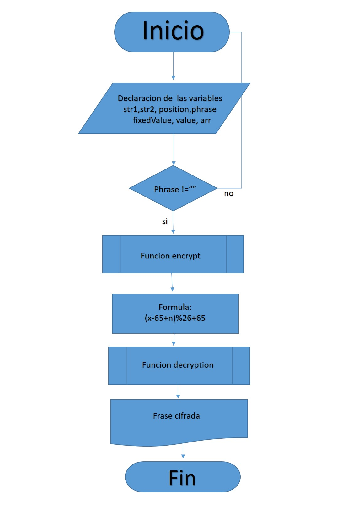

### Producto Final
#### Cifrado de Cesar
Este proyecto se trata de encriptar y desencriptar un texto o frase que ingrese el usuario mediante el "cifrado de Cesar" .
##### Pseudocodigo
###### 
Inicio
//creando una funcion para encriptar la frase ingresada
funcion encrypt {
   //Ingresando frase a encriptar
  var phrase = document.getElementById("frase").value;      //=prompt("Ingresa una frase");
  // Declarando variables
  variable encrypting igual a vacio
  //recorriendo la frase con la sentencia For
   para la variable i igual a 0 hasta que i sea menor que la longitud de la phrase incrementando la variable i de uno en uno
      //declaro variable storeNumber para almacenar el numero de la letra ascii
      variable storeNumber=phrase.charCodeAt(i);
      //declaro la variable value y calculamos el valor de la operacion hallada por la formula del cifrado cesar
      variable value=(storeNumber-65+33)%26+65;
      //acumulo en la variable encrypting la letra cifrada
      encrypting +=String.fromCharCode(value);
   }
   //retorno la frase desencriptada mediante un document.write
   document.write('frase encriptada:' + encrypting);
}

//creando una funcion descriptando la frase ingresada
function decrypting(){
declarando la variable phrase igual al document.getElementById("frase").value;
//declaro la variable que almacenará la frase desencriptado
declarando la variable decrypt='';
//recorro cada caracter la frase
para la variable i igual a 0 hasta que i sea menor que la longitud de la phrase incrementamos de uno en uno
    //declaro variable storeNumber para almacenar el numero de la letra ascii
    declaramos la variable storeNumber=phrase.charCodeAt(i);
    //declaro variable value para obtener la formula del cifrado cesar
    declaramos la variable  value=(storeNumber+65-33)%26+65;
    //acumulo en la variable decrypt la letra desencriptada
    decrypt+=String.fromCharCode(value);
}
//retorno la frase desencriptado mediante un document.write
 document.write('frase desencriptada:' + decrypt);
}
final

##### Diagrama de flujo

